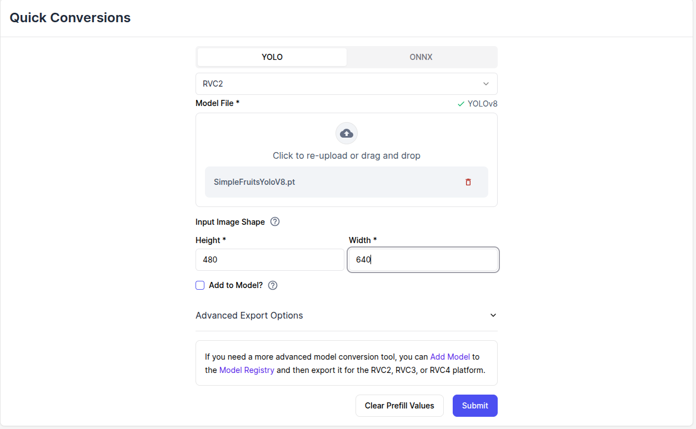

# AI Netwerk


## Training


### Yolo V8
Er is een Colab notebook trainingesmodel beschikbaar.

[Yolo V8 training](https://colab.research.google.com/drive/1M_Fnquk3dmfuBLfpjgMGVwj35Em1-wfP)

Volg de instructies van het Colab notebook.

### PyTorch
Je kunt ook een eigen script maken met PyTorch, zie: [ultralytics](https://docs.ultralytics.com/models/yolov8/) 

## Conversie van Yolo bestanden naar blob bestanden


Na training dient het netwerkbestand `best.pt` geconverteerd te worden naar een DepthAI compatible bestanden:

Gebruik hiervoor de [Luxonis Quick Conversion tool](https://docs.luxonis.com/cloud/hubai/quick-conversion/)



Na conversie wordt er een bestand gegenereerd:
* `<source_file>.rvc2.tar.xz`: Eigenlijke AI Netwerk, welke in de camera kan worden geladen


Plaats het bestand in de `resources` map van de `my_depthai_python` package.

## Uitrollen

Modificeer het `spatial_detector.yaml` uit de `config` map van de `my_depthai_python` package.

Vervang de volgende regel:
```yaml
    nn_archive: SimpleFruitsYoloV8.rvc2.tar.xz
```

door:
```yaml
    nn_archive: "<my_yolo_network>.rvc2.tar.xz"
```

## Netwerk testen
Sluit de DepthAi camera aan op de computer en start de volgende ROS2 applicatie

```bash
ros2 launch my_depthai_python spatial_detector.launch.py
```