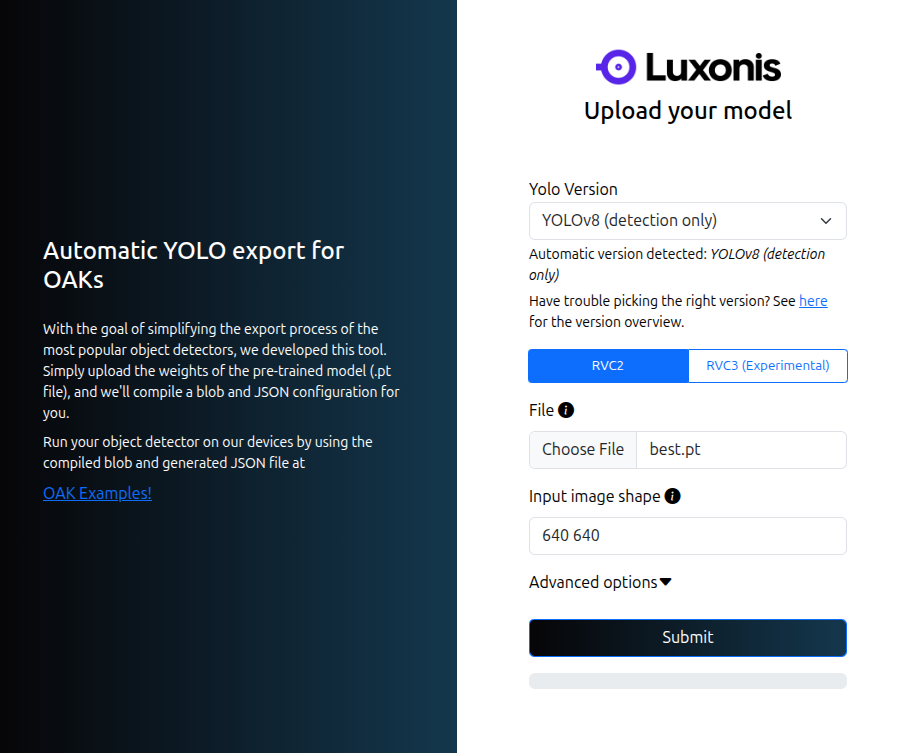

# AI Netwerk


## Training

### Yolo V5
Er is een Colab notebook trainingesmodel beschikbaar.

[Yolo V5 training](https://colab.research.google.com/drive/1g6glENMju05OKoRe5LVrZOE8yrH-ALjX#scrollTo=aRxrsCBzIb1I)

Volg de instructies van het Colab notebook.

### Yolo V8
Er is een Colab notebook trainingesmodel beschikbaar.

[Yolo V8 training](https://colab.research.google.com/drive/1M_Fnquk3dmfuBLfpjgMGVwj35Em1-wfP)

Volg de instructies van het Colab notebook.

### PyTorch
Je kunt ook een eigen script maken met PyTorch, zie: [ultralytics](https://docs.ultralytics.com/models/yolov8/) 

## Conversie van Yolo bestanden naar blob bestanden


Na training dient het netwerkbestand `best.pt` geconverteerd te worden naar een tweetal DepthAI compatible bestanden:

Gebruik hiervoor de [luxonis conversie tool](https://tools.luxonis.com/)



Na conversie worden 2 bestanden gegenereerd:
* `*.blob`: Eigenlijke AI Netwerk, welke in de camera wordt geladen

* `*.json` : bestand met karakteristieke eigenschappen van het `blob` bestand zoals labels van de te detecteren objecten.

Je kunt de namen van de bestanden wijzigen naar nieuwe namen zoals b.v. `<my_yolo_network>.blob` en `<my_yolo_network>.json`

Plaats beide bestanden in de `resource` map van de `my_depthai` package.

## Uitrollen

Modificeer het `yolo_spatial_detector_node.launch.py` uit de `launch` map van de `my_depthai` package.

Vervang de volgende regels:
```python
nnName = LaunchConfiguration('nnName', default = "SimpleFruitsYoloV8.blob")
nnConfig = LaunchConfiguration('nnConfig', default = "SimpleFruitsYoloV8.json")
```

door:
```python
nnName = LaunchConfiguration('nnName', default = "<my_yolo_network>.blob")
nnConfig = LaunchConfiguration('nnConfig', default = "<my_yolo_network>.json")

```

## Netwerk testen
Sluit de DepthAi camera aan op de computer en start de volgende ROS2 applicatie

```bash
ros2 launch my_depthai yolo_spatial_detector_node.launch.py
```