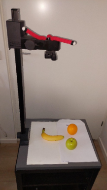
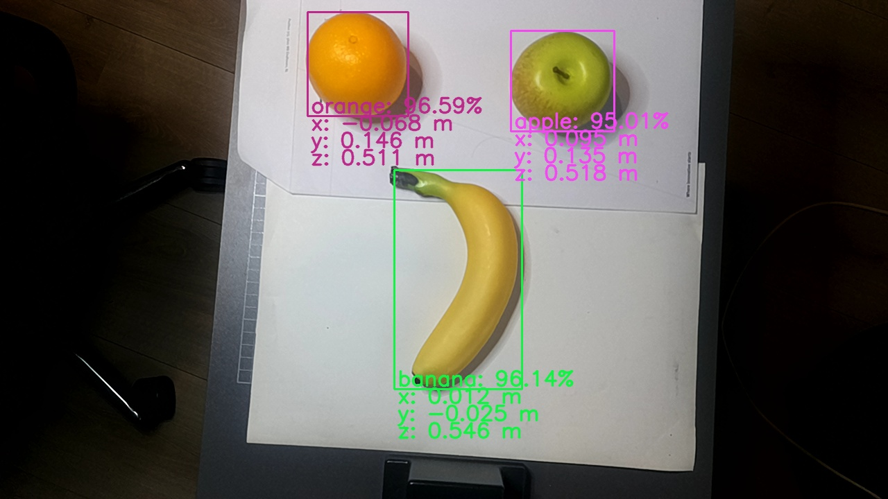

# Applicaties


## Yolo spatial(ruimtelijk) network detector
Deze appilicatie  demonsteert de cassificatie en positie van een object gedetecteerd met een neuraal netwerk. De positie van het object is relatief t.o.v de camera.

```bash
ros2 launch my_depthai_python spatial_detector.launch.py
```




### Configuratie neuraal netwerk
Om een eigen netwerk te gebruiken plaats je het blob en json bestand van je netwerk in de `resources` map van de `my_depthai_python` package en modificeer het `spatial_detector.yaml` bestand uit de `config` map van de `my_depthai_python` package.

Vervang de volgende regels:
```yaml
    blob_name: SimpleFruitsYoloV8.blob
    config_name: SimpleFruitsYoloV8.json
```

door:
```yaml
    blob_name: "<my_yolo_network>.blob"
    config_name: "<my_yolo_network>.json"
```


### Verklaring ROS topics (`ros2 topic list`)

/camera/camera_info
/camera/rgb
/camera_description
/spatial_detections
/stereo/depth


### /color/yolov4_spatial_detections topic voorbeeld: 
Hier is een voorbeeld van een bericht dat wordt gepubliceerd op het `/color/yolov4_spatial_detections` topic, dat de resultaten van een YOLOv4-ruimtelijke detectie bevat. Dit bericht is in YAML-formaat en toont de gedetecteerde objecten, hun klassen, scores, bounding boxes en 3D-posities ten opzichte van de camera.

```yaml
header:
  stamp:
    sec: 1779299981
    nanosec: 965254354
  frame_id: oak_rgb_camera_optical_frame
detections:
- results:
  - class_id: '1'
    score: 0.9013671875
  bbox:
    center:
      position:
        x: 485.0
        y: 270.5
      theta: 0.0
    size_x: 310.0
    size_y: 489.0
  position:
    x: 0.1642097681760788
    y: 0.04885092377662659
    z: 0.906000018119812
  is_tracking: false
  tracking_id: ''
  ```