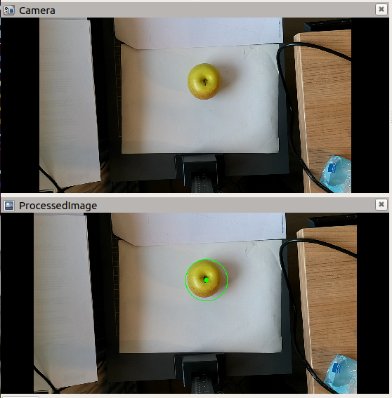

# Applicaties


## Cirkel detector
Deze applicatie demonstreet een cirkel detect in een image en publiceert de gedetecteerd circles isn een nieuw image.

```bash
ros2 launch my_depthai stereo_circle_detector.launch.py
```



## Neural network detector
```bash
ros2 launch my_depthai stereo_circle_detector.launch.py
```


### Configuratie neuraal netwerk
Om een eigen netwerk te gebruiken plaats je het blob en json bestand van je netwerk in de `resources` map van de `my_depthai` package en configureert het `yolo_spatial_detector_node.launch.py` in de `launch` map van de `my_depthai` package op de volgende regels:

```python
nnName = LaunchConfiguration('nnName', default = "SimpleFruitsYoloV8.blob")
nnConfig = LaunchConfiguration('nnConfig', default = "SimpleFruitsYoloV8.json")
```


### Verklaring ROS topics (`ros2 topic list`)

- `/clicked_point`: Door RViz aangeklikt 3D-punt.
- `/color/ObjectText`: Tekstlabel(s) van gedetecteerde objecten.
- `/color/ObjectText_array`: Array met meerdere objectlabels.
- `/color/camera_info`: Camera-calibratie en intrinsics van de kleurcamera.
- `/color/detections`: Detectiebeeld met resultaten van objectdetectie.
- `/color/detections/compressed`: Gecomprimeerde transportversie van `/color/detections`.
- `/color/detections/compressedDepth`: Depth-transportversie van `/color/detections`.
- `/color/detections/theora`: Theora-gecodeerde stream van `/color/detections`.
- `/color/detections/zstd`: Zstd-gecomprimeerde stream van `/color/detections`.
- `/color/image_rect`: Gecorrigeerd (rectified) kleurbeeld.
- `/color/image_rect/compressed`: Gecomprimeerde transportversie van `/color/image_rect`.
- `/color/image_rect/compressedDepth`: Depth-transportversie van `/color/image_rect`.
- `/color/image_rect/theora`: Theora-gecodeerde stream van `/color/image_rect`.
- `/color/image_rect/zstd`: Zstd-gecomprimeerde stream van `/color/image_rect`.
- `/color/image_w_bouding_boxes`: Kleurbeeld met ingetekende bounding boxes.
- `/color/yolov4_spatial_detections`: 3D YOLO-detectieresultaten (positie + klasse).
- `/initialpose`: Startpose die meestal vanuit RViz wordt gezet.
- `/joint_states`: Huidige gewrichtstoestanden van het robotmodel.
- `/left/camera_info`: Camera-info van de linker camera.
- `/left/image_rect`: Gecorrigeerd beeld van de linker camera.
- `/left/image_rect/compressed`: Gecomprimeerde versie van linker beeld.
- `/left/image_rect/compressedDepth`: Depth-transportversie van linker beeld.
- `/left/image_rect/theora`: Theora-stream van linker beeld.
- `/left/image_rect/zstd`: Zstd-stream van linker beeld.
- `/move_base_simple/goal`: Doelpose die meestal vanuit RViz wordt gezet.
- `/parameter_events`: ROS2-events bij parameterwijzigingen.
- `/right/camera_info`: Camera-info van de rechter camera.
- `/right/image_rect`: Gecorrigeerd beeld van de rechter camera.
- `/right/image_rect/compressed`: Gecomprimeerde versie van rechter beeld.
- `/right/image_rect/compressedDepth`: Depth-transportversie van rechter beeld.
- `/right/image_rect/theora`: Theora-stream van rechter beeld.
- `/right/image_rect/zstd`: Zstd-stream van rechter beeld.
- `/robot_description`: URDF robotbeschrijving.
- `/rosout`: Centrale ROS2 log-output.
- `/stereo/camera_info`: Camera-info van de stereo/depth-pipeline.
- `/stereo/converted_depth`: Geconverteerd dieptebeeld.
- `/stereo/converted_depth/compressed`: Gecomprimeerde versie van geconverteerde diepte.
- `/stereo/converted_depth/compressedDepth`: Depth-transportversie van geconverteerde diepte.
- `/stereo/converted_depth/theora`: Theora-stream van geconverteerde diepte.
- `/stereo/converted_depth/zstd`: Zstd-stream van geconverteerde diepte.
- `/stereo/depth`: Ruw of standaard dieptebeeld uit stereo.
- `/stereo/depth/compressed`: Gecomprimeerde versie van `/stereo/depth`.
- `/stereo/depth/compressedDepth`: Depth-transportversie van `/stereo/depth`.
- `/stereo/depth/theora`: Theora-stream van `/stereo/depth`.
- `/stereo/depth/zstd`: Zstd-stream van `/stereo/depth`.
- `/stereo/points`: Pointcloud op basis van stereodiepte.
- `/tf`: Dynamische transformaties tussen frames.
- `/tf_static`: Statische (niet-veranderende) transformaties.